# **Predict students' dropout and academic success**

-- ELEC3544 Group Project

## --------------------- Workflow ---------------------
### **Phase 1: Data Acquisition & Initial Scoping**
* **Data Ingestion:** Load the dataset and verify dimensions.
* **Target Definition:** Identify the 3-class target (`Dropout`, `Enrolled`, `Graduate`).
* **Mapping:** Convert categorical IDs into readable strings for analysis (if necessary) to ensure the EDA makes sense to a human reader.
### **Phase 2: Systematic Data Quality Assessment (Cleaning)**
* **Structure:** Check data types (Integer vs. Float). Ensure categorical variables are handled as such and not treated as continuous numbers.
* **Completeness:** Check for missing values (The UCI dataset is famously "clean," but you must demonstrate that you checked).
* **Validity:**
  * Verify numerical ranges (e.g., Grades should be between 0–20).
  * Check for logical errors (e.g., Are there students with "0 units enrolled" but a "grade of 15"?).
* **Distributional:** Check for skewness in features like `Age at enrollment`. Decide if outliers (mature students) should be capped or kept.
### **Phase 3: Exploratory Data Analysis (EDA)**
* **Correlation Block Analysis:**
  1. Academic Block: Identifying redundancy between 1st and 2nd semesters.
  2. Socio-Economic Block: Assessing parental influence.
  3. Financial Block: Testing the impact of debt/scholarships.
  4. Demographic Block: Checking for bias (`Gender` / `Age`).
* **Feature-Target Relationship:** Visualizing how the top correlated features (like *Grades* or *Tuition* status) differ across the three Target classes using Boxplots or Violin plots.
### **Phase 4: Feature Selection & Engineering**
* **Dimensionality Reduction:**
  * Drop redundant features (e.g., dropping `Nationality` if `International` provides the same info).
  * Drop low-variance features (e.g., `GDP`, `Inflation`, and `Unemployment` if they show near-zero correlation with the target).
* **Feature Construction:** (Optional) Create an "Academic Progression" feature by calculating the difference between 2nd-semester grades and 1st-semester grades.
* **Data Transformation:** Apply StandardScaler to numerical features (essential for Logistic Regression) and One-Hot Encoding for categorical features that aren't ordinal.
### **Phase 5: Model Selection & Training Strategy**
* **Baseline Model (Logistic Regression):**
  * **Goal:** Establish a "transparent" benchmark.
  * **Action:** Analyze coefficients to explain which factors increase the probability of dropout.
* **Advanced Model (Random Forest):**
  * **Goal:** Capture non-linear relationships and interactions between variables.
  * **Action:** Compare performance against the baseline.
* **Cross-Validation:** Use 5-fold Stratified Cross-Validation to ensure the model isn't just "getting lucky" on a specific slice of data.
### **Phase 6: Model Evaluation & Interpretation**
* **Metric Selection:**
  * Don't just use **Accuracy**.
  * Use a **Confusion Matrix** to see if the model confuses "Enrolled" with "Dropout."
  * Use **F1-Score** and **Recall** (Recall is critical here because missing a potential dropout is more "expensive" for a university than misidentifying a graduate).
* **Feature Importance:** Compare the "Weights" from Logistic Regression with the "Importance" from Random Forest.
### **Phase 7: Post-Mortem & Recommendations - [Coursework Conclusion]**
* **The "So What?":** Translate the math into policy. (e.g., "Since 'Tuition fees up to date' is the strongest predictor, the university should implement financial counseling for students in debt by the end of Semester 1.")
* **Limitations:** Discuss what data was missing (e.g., Mental health data or Social integration data) that could have made the model better.
* **Final Summary:** Conclude whether the project succeeded in creating an **"Early Warning System"**.

# **Step 1: Setup and Loading Data**


```python
# Install the UCI Repository library
!pip install ucimlrepo -q
```


```python
import pandas as pd
import matplotlib.pyplot as plt
import seaborn as sns
from ucimlrepo import fetch_ucirepo

# Fetch dataset
predict_students_dropout_and_academic_success = fetch_ucirepo(id=697)

# Data (as pandas dataframes)
df = predict_students_dropout_and_academic_success.data.features
df = df.rename(columns={'Nacionality': 'Nationality'})
target = predict_students_dropout_and_academic_success.data.targets

# Combine them for a full quality assessment
full_df = pd.concat([df, target], axis=1)

# 數值化 Target (Dropout=0, Enrolled=1, Graduate=2)
target_map = {'Dropout': 0, 'Enrolled': 1, 'Graduate': 2}
full_df['Target_num'] = full_df['Target'].map(target_map)

print("Dataset loaded successfully!")
full_df.head()
```
    Dataset loaded successfully!
  <div id="df-b9642354-6f8b-44fd-8ad3-412d562a8fd2" class="colab-df-container">
    <div>
<table border="1" class="dataframe">
  <thead>
    <tr style="text-align: right;">
      <th></th>
      <th>Marital Status</th>
      <th>Application mode</th>
      <th>Application order</th>
      <th>Course</th>
      <th>Daytime/evening attendance</th>
      <th>Previous qualification</th>
      <th>Previous qualification (grade)</th>
      <th>Nationality</th>
      <th>Mother's qualification</th>
      <th>Father's qualification</th>
      <th>...</th>
      <th>Curricular units 2nd sem (enrolled)</th>
      <th>Curricular units 2nd sem (evaluations)</th>
      <th>Curricular units 2nd sem (approved)</th>
      <th>Curricular units 2nd sem (grade)</th>
      <th>Curricular units 2nd sem (without evaluations)</th>
      <th>Unemployment rate</th>
      <th>Inflation rate</th>
      <th>GDP</th>
      <th>Target</th>
      <th>Target_num</th>
    </tr>
  </thead>
  <tbody>
    <tr>
      <th>0</th>
      <td>1</td>
      <td>17</td>
      <td>5</td>
      <td>171</td>
      <td>1</td>
      <td>1</td>
      <td>122.0</td>
      <td>1</td>
      <td>19</td>
      <td>12</td>
      <td>...</td>
      <td>0</td>
      <td>0</td>
      <td>0</td>
      <td>0.000000</td>
      <td>0</td>
      <td>10.8</td>
      <td>1.4</td>
      <td>1.74</td>
      <td>Dropout</td>
      <td>0</td>
    </tr>
    <tr>
      <th>1</th>
      <td>1</td>
      <td>15</td>
      <td>1</td>
      <td>9254</td>
      <td>1</td>
      <td>1</td>
      <td>160.0</td>
      <td>1</td>
      <td>1</td>
      <td>3</td>
      <td>...</td>
      <td>6</td>
      <td>6</td>
      <td>6</td>
      <td>13.666667</td>
      <td>0</td>
      <td>13.9</td>
      <td>-0.3</td>
      <td>0.79</td>
      <td>Graduate</td>
      <td>2</td>
    </tr>
    <tr>
      <th>2</th>
      <td>1</td>
      <td>1</td>
      <td>5</td>
      <td>9070</td>
      <td>1</td>
      <td>1</td>
      <td>122.0</td>
      <td>1</td>
      <td>37</td>
      <td>37</td>
      <td>...</td>
      <td>6</td>
      <td>0</td>
      <td>0</td>
      <td>0.000000</td>
      <td>0</td>
      <td>10.8</td>
      <td>1.4</td>
      <td>1.74</td>
      <td>Dropout</td>
      <td>0</td>
    </tr>
    <tr>
      <th>3</th>
      <td>1</td>
      <td>17</td>
      <td>2</td>
      <td>9773</td>
      <td>1</td>
      <td>1</td>
      <td>122.0</td>
      <td>1</td>
      <td>38</td>
      <td>37</td>
      <td>...</td>
      <td>6</td>
      <td>10</td>
      <td>5</td>
      <td>12.400000</td>
      <td>0</td>
      <td>9.4</td>
      <td>-0.8</td>
      <td>-3.12</td>
      <td>Graduate</td>
      <td>2</td>
    </tr>
    <tr>
      <th>4</th>
      <td>2</td>
      <td>39</td>
      <td>1</td>
      <td>8014</td>
      <td>0</td>
      <td>1</td>
      <td>100.0</td>
      <td>1</td>
      <td>37</td>
      <td>38</td>
      <td>...</td>
      <td>6</td>
      <td>6</td>
      <td>6</td>
      <td>13.000000</td>
      <td>0</td>
      <td>13.9</td>
      <td>-0.3</td>
      <td>0.79</td>
      <td>Graduate</td>
      <td>2</td>
    </tr>
  </tbody>
</table>
<pre>5 rows × 38 columns</pre>
</div>
    <div class="colab-df-buttons">

  <div class="colab-df-container">
    <button class="colab-df-convert" onclick="convertToInteractive('df-b9642354-6f8b-44fd-8ad3-412d562a8fd2')"
            title="Convert this dataframe to an interactive table."
            style="display:none;">

  <svg xmlns="http://www.w3.org/2000/svg" height="24px" viewBox="0 -960 960 960">
    <path d="M120-120v-720h720v720H120Zm60-500h600v-160H180v160Zm220 220h160v-160H400v160Zm0 220h160v-160H400v160ZM180-400h160v-160H180v160Zm440 0h160v-160H620v160ZM180-180h160v-160H180v160Zm440 0h160v-160H620v160Z"/>
  </svg>
    </button>
  </div>

  </div>


# **Step 2: Systematic data quality assessment**
## 1. Structure Assessment


```python
print("--- STRUCTURE ASSESSMENT ---")
# Check dimensions
print(f"Dataset Shape: {full_df.shape}")

# Check data types and memory usage
print("\nData Types and Info:")
print(full_df.info())

# Check for the column names to ensure they are clean
print("\nColumn Names:")
print(full_df.columns.tolist())
```

    --- STRUCTURE ASSESSMENT ---
    Dataset Shape: (4424, 38)
    
    Data Types and Info:
    <class 'pandas.core.frame.DataFrame'>
    RangeIndex: 4424 entries, 0 to 4423
    Data columns (total 38 columns):
     #   Column                                          Non-Null Count  Dtype  
    ---  ------                                          --------------  -----  
     0   Marital Status                                  4424 non-null   int64  
     1   Application mode                                4424 non-null   int64  
     2   Application order                               4424 non-null   int64  
     3   Course                                          4424 non-null   int64  
     4   Daytime/evening attendance                      4424 non-null   int64  
     5   Previous qualification                          4424 non-null   int64  
     6   Previous qualification (grade)                  4424 non-null   float64
     7   Nationality                                     4424 non-null   int64  
     8   Mother's qualification                          4424 non-null   int64  
     9   Father's qualification                          4424 non-null   int64  
     10  Mother's occupation                             4424 non-null   int64  
     11  Father's occupation                             4424 non-null   int64  
     12  Admission grade                                 4424 non-null   float64
     13  Displaced                                       4424 non-null   int64  
     14  Educational special needs                       4424 non-null   int64  
     15  Debtor                                          4424 non-null   int64  
     16  Tuition fees up to date                         4424 non-null   int64  
     17  Gender                                          4424 non-null   int64  
     18  Scholarship holder                              4424 non-null   int64  
     19  Age at enrollment                               4424 non-null   int64  
     20  International                                   4424 non-null   int64  
     21  Curricular units 1st sem (credited)             4424 non-null   int64  
     22  Curricular units 1st sem (enrolled)             4424 non-null   int64  
     23  Curricular units 1st sem (evaluations)          4424 non-null   int64  
     24  Curricular units 1st sem (approved)             4424 non-null   int64  
     25  Curricular units 1st sem (grade)                4424 non-null   float64
     26  Curricular units 1st sem (without evaluations)  4424 non-null   int64  
     27  Curricular units 2nd sem (credited)             4424 non-null   int64  
     28  Curricular units 2nd sem (enrolled)             4424 non-null   int64  
     29  Curricular units 2nd sem (evaluations)          4424 non-null   int64  
     30  Curricular units 2nd sem (approved)             4424 non-null   int64  
     31  Curricular units 2nd sem (grade)                4424 non-null   float64
     32  Curricular units 2nd sem (without evaluations)  4424 non-null   int64  
     33  Unemployment rate                               4424 non-null   float64
     34  Inflation rate                                  4424 non-null   float64
     35  GDP                                             4424 non-null   float64
     36  Target                                          4424 non-null   object 
     37  Target_num                                      4424 non-null   int64  
    dtypes: float64(7), int64(30), object(1)
    memory usage: 1.3+ MB
    None
    
    Column Names:
    ['Marital Status', 'Application mode', 'Application order', 'Course', 'Daytime/evening attendance', 'Previous qualification', 'Previous qualification (grade)', 'Nationality', "Mother's qualification", "Father's qualification", "Mother's occupation", "Father's occupation", 'Admission grade', 'Displaced', 'Educational special needs', 'Debtor', 'Tuition fees up to date', 'Gender', 'Scholarship holder', 'Age at enrollment', 'International', 'Curricular units 1st sem (credited)', 'Curricular units 1st sem (enrolled)', 'Curricular units 1st sem (evaluations)', 'Curricular units 1st sem (approved)', 'Curricular units 1st sem (grade)', 'Curricular units 1st sem (without evaluations)', 'Curricular units 2nd sem (credited)', 'Curricular units 2nd sem (enrolled)', 'Curricular units 2nd sem (evaluations)', 'Curricular units 2nd sem (approved)', 'Curricular units 2nd sem (grade)', 'Curricular units 2nd sem (without evaluations)', 'Unemployment rate', 'Inflation rate', 'GDP', 'Target', 'Target_num']


## 2. Completeness Assessment


```python
print("--- COMPLETENESS ASSESSMENT ---")

# Count missing values per column
missing_values = full_df.isnull().sum()
missing_percentage = (missing_values / len(full_df)) * 100

# Display only columns that have missing values (if any)
if missing_values.sum() == 0:
    print("Success: No missing values detected in the dataset.")
else:
    print("Missing values found:")
    print(missing_values[missing_values > 0])

# Visualizing completeness (Useful for large datasets)
plt.figure(figsize=(10, 4))
sns.heatmap(full_df.isnull(), yticklabels=False, cbar=False, cmap='viridis')
plt.title("Missing Data Heatmap (Purple = Data Present, Yellow = Missing)")
plt.show()
```

    --- COMPLETENESS ASSESSMENT ---
    Success: No missing values detected in the dataset.


    
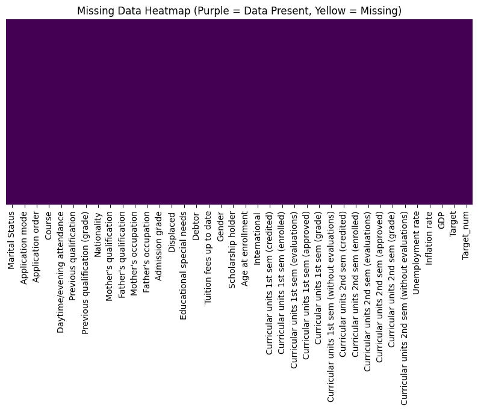
    


## 3. Validity Assessment


```python
print("--- VALIDITY ASSESSMENT ---")

# 1. Check for Duplicate Rows
duplicates = full_df.duplicated().sum()
print(f"Number of duplicate rows: {duplicates}")

# 2. Logical Range Check (Summary Statistics)
# We look for impossible values like negative 'Age at enrollment' or 'Curricular units 1st sem (grade)' > 20
print("\nDescriptive Statistics for Range Validation:")
display(full_df[['Age at enrollment', 'Curricular units 1st sem (grade)', 'Curricular units 2nd sem (grade)']].describe())

# 3. Categorical Validity
# Check the unique values in the Target variable
print("\nUnique values in Target (Should be Dropout, Graduate, or Enrolled):")
print(full_df['Target'].unique())
```

    --- VALIDITY ASSESSMENT ---
    Number of duplicate rows: 0
    
    Descriptive Statistics for Range Validation:


  <div id="df-5adf337f-5e40-415a-89a4-925b5d664e85" class="colab-df-container">
    <div>

<table border="1" class="dataframe">
  <thead>
    <tr style="text-align: right;">
      <th></th>
      <th>Age at enrollment</th>
      <th>Curricular units 1st sem (grade)</th>
      <th>Curricular units 2nd sem (grade)</th>
    </tr>
  </thead>
  <tbody>
    <tr>
      <th>count</th>
      <td>4424.000000</td>
      <td>4424.000000</td>
      <td>4424.000000</td>
    </tr>
    <tr>
      <th>mean</th>
      <td>23.265145</td>
      <td>10.640822</td>
      <td>10.230206</td>
    </tr>
    <tr>
      <th>std</th>
      <td>7.587816</td>
      <td>4.843663</td>
      <td>5.210808</td>
    </tr>
    <tr>
      <th>min</th>
      <td>17.000000</td>
      <td>0.000000</td>
      <td>0.000000</td>
    </tr>
    <tr>
      <th>25%</th>
      <td>19.000000</td>
      <td>11.000000</td>
      <td>10.750000</td>
    </tr>
    <tr>
      <th>50%</th>
      <td>20.000000</td>
      <td>12.285714</td>
      <td>12.200000</td>
    </tr>
    <tr>
      <th>75%</th>
      <td>25.000000</td>
      <td>13.400000</td>
      <td>13.333333</td>
    </tr>
    <tr>
      <th>max</th>
      <td>70.000000</td>
      <td>18.875000</td>
      <td>18.571429</td>
    </tr>
  </tbody>
</table>
</div>
    <div class="colab-df-buttons">

  <div class="colab-df-container">
    <button class="colab-df-convert" onclick="convertToInteractive('df-5adf337f-5e40-415a-89a4-925b5d664e85')"
            title="Convert this dataframe to an interactive table."
            style="display:none;">

  <svg xmlns="http://www.w3.org/2000/svg" height="24px" viewBox="0 -960 960 960">
    <path d="M120-120v-720h720v720H120Zm60-500h600v-160H180v160Zm220 220h160v-160H400v160Zm0 220h160v-160H400v160ZM180-400h160v-160H180v160Zm440 0h160v-160H620v160ZM180-180h160v-160H180v160Zm440 0h160v-160H620v160Z"/>
  </svg>
    </button>

  </div>

    Unique values in Target (Should be Dropout, Graduate, or Enrolled):
    ['Dropout' 'Graduate' 'Enrolled']


## 4. Distributional Assessment


```python
print("--- DISTRIBUTIONAL ASSESSMENT ---")

# 1. Target Variable Distribution (Class Imbalance check)
plt.figure(figsize=(8, 5))
sns.countplot(x='Target',legend=False, data=full_df, hue='Target')
plt.title("Distribution of the Target Variable (Class Balance)")
plt.show()

# 2. Feature Distribution (Checking for Skewness/Outliers)
# Let's look at 'Age at enrollment'
plt.figure(figsize=(10, 5))
sns.histplot(full_df['Age at enrollment'], kde=True, color='blue')
plt.title("Distribution of Age at Enrollment")
plt.show()

# 3. Correlation check (Detecting Multicollinearity)
plt.figure(figsize=(12, 10))
# Correlation only for numerical columns
corr = full_df.select_dtypes(include=['number']).corr()
sns.heatmap(corr, annot=False, cmap='coolwarm', fmt=".1f")
plt.title("Feature Correlation Heatmap")
plt.show()
```

    --- DISTRIBUTIONAL ASSESSMENT ---
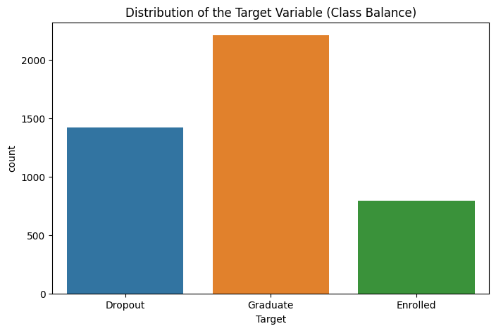
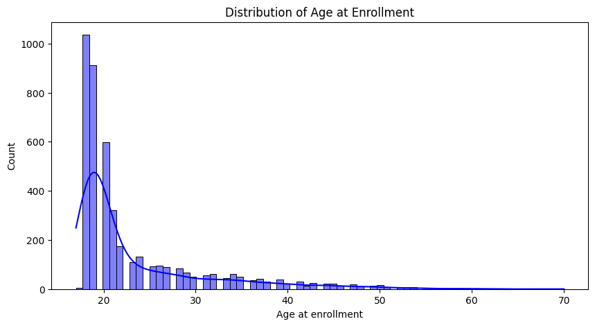
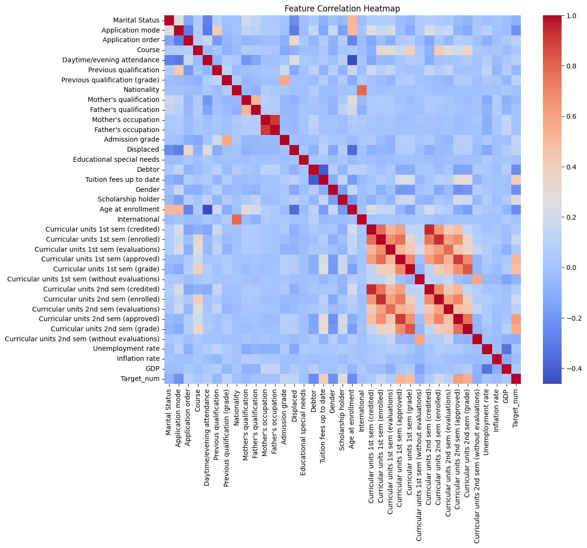
    


# **Part 3: Handling High Correlations**
We use 1) **DROP**, 2) **COMBINE** or 3) **KEEP** (Model Regularzation) to handle high correlations features
## 1. Academic Features


```python
# 1. Academic Features List
academic_cols = [
    'Curricular units 1st sem (credited)', 'Curricular units 1st sem (enrolled)',
    'Curricular units 1st sem (evaluations)', 'Curricular units 1st sem (approved)',
    'Curricular units 1st sem (grade)', 'Curricular units 1st sem (without evaluations)',
    'Curricular units 2nd sem (credited)', 'Curricular units 2nd sem (enrolled)',
    'Curricular units 2nd sem (evaluations)', 'Curricular units 2nd sem (approved)',
    'Curricular units 2nd sem (grade)', 'Curricular units 2nd sem (without evaluations)'
]
plt.figure(figsize=(12, 10))
corr_academic = full_df[academic_cols].corr()

sns.heatmap(corr_academic, annot=True, fmt=".2f", cmap='coolwarm', center=0, linewidths=0.5)
plt.title('Feature Correlation: Academic Performance', fontsize=15, pad=20)
plt.show()

# Insight: Look for values > 0.80. These are candidates for combining into an "Annual Average".
```


    
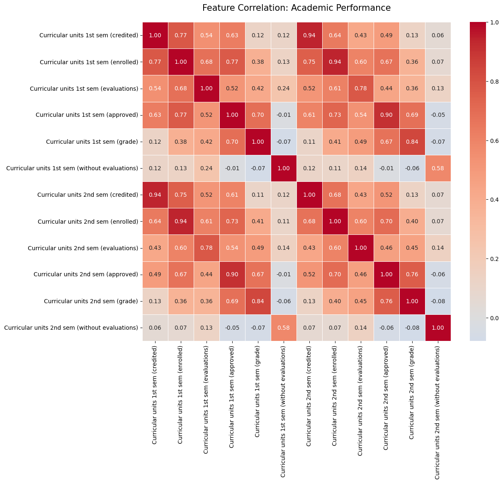
    


### Feature Engineering (Combining features)
**Feature Engineering Strategy**: Instead of using raw semester-wise data which exhibited high multicollinearity, we synthesized four behavioral metrics: **Grade Trend, Approved Difference, Success Rate, and Average Grade**. This approach reduces the feature space while emphasizing the dynamic academic progression of students, which is hypothesized to be a stronger predictor of dropout than static semester snapshots.


```python
import pandas as pd
import numpy as np

# 1. New Engineered Features

# A. Grade Trending: Positive for improvment, negative for falling back
full_df['Grade_Trend'] = full_df['Curricular units 2nd sem (grade)'] - full_df['Curricular units 1st sem (grade)']

# B. Approved Difference: Observing whether students adapt better in the second semester
full_df['Approved_Diff'] = full_df['Curricular units 2nd sem (approved)'] - full_df['Curricular units 1st sem (approved)']

# C. Success Rate: Total number of students passed / Total number of students enrolled
# Note: To avoid division by zero error, we added a very small epsilon
total_enrolled = full_df['Curricular units 1st sem (enrolled)'] + full_df['Curricular units 2nd sem (enrolled)']
total_approved = full_df['Curricular units 1st sem (approved)'] + full_df['Curricular units 2nd sem (approved)']
full_df['Credit_Success_Rate'] = total_approved / (total_enrolled + 1e-5)

# D. Average Academic Grade
full_df['Avg_Grade'] = (full_df['Curricular units 1st sem (grade)'] + full_df['Curricular units 2nd sem (grade)']) / 2

# 2. Define original 12 highly correlated features to be removed
original_academic_cols = [col for col in full_df.columns if 'sem' in col]

# 3. Create a simplified dataframe for subsequent modeling
# We retain the new features and remove the old academic features
reduced_df = full_df.drop(columns=academic_cols)

print("New features have been established, and the original academic features have been removed.")
print(f"Number of features remaining: {len(reduced_df.columns)}")
reduced_df[['Grade_Trend', 'Approved_Diff', 'Credit_Success_Rate', 'Avg_Grade']].head()
```

    New features have been established, and the original academic features have been removed.
    Number of features remaining: 30

  <div id="df-de4538f2-3bc2-47fa-b046-bb6c8f746b48" class="colab-df-container">
    <div>

<table border="1" class="dataframe">
  <thead>
    <tr style="text-align: right;">
      <th></th>
      <th>Grade_Trend</th>
      <th>Approved_Diff</th>
      <th>Credit_Success_Rate</th>
      <th>Avg_Grade</th>
    </tr>
  </thead>
  <tbody>
    <tr>
      <th>0</th>
      <td>0.000000</td>
      <td>0</td>
      <td>0.000000</td>
      <td>0.000000</td>
    </tr>
    <tr>
      <th>1</th>
      <td>-0.333333</td>
      <td>0</td>
      <td>0.999999</td>
      <td>13.833333</td>
    </tr>
    <tr>
      <th>2</th>
      <td>0.000000</td>
      <td>0</td>
      <td>0.000000</td>
      <td>0.000000</td>
    </tr>
    <tr>
      <th>3</th>
      <td>-1.028571</td>
      <td>-1</td>
      <td>0.916666</td>
      <td>12.914286</td>
    </tr>
    <tr>
      <th>4</th>
      <td>0.666667</td>
      <td>1</td>
      <td>0.916666</td>
      <td>12.666667</td>
    </tr>
  </tbody>
</table>
</div>
    <div class="colab-df-buttons">

  <div class="colab-df-container">
    <button class="colab-df-convert" onclick="convertToInteractive('df-de4538f2-3bc2-47fa-b046-bb6c8f746b48')"
            title="Convert this dataframe to an interactive table."
            style="display:none;">

  <svg xmlns="http://www.w3.org/2000/svg" height="24px" viewBox="0 -960 960 960">
    <path d="M120-120v-720h720v720H120Zm60-500h600v-160H180v160Zm220 220h160v-160H400v160Zm0 220h160v-160H400v160ZM180-400h160v-160H180v160Zm440 0h160v-160H620v160ZM180-180h160v-160H180v160Zm440 0h160v-160H620v160Z"/>
  </svg>
    </button>

 

 
  </div>


**Verify: Correlation between engineered features & target**


```python
# 1. Ensure the target has been quantified (Dropout=0, Enrolled=1, Graduate=2)
# If this has already been done, this line will be executed directly
if 'Target_num' not in full_df.columns:
    target_map = {'Dropout': 0, 'Enrolled': 1, 'Graduate': 2}
    full_df['Target_num'] = full_df['Target'].map(target_map)

# 2. Define the simplified feature list you create
reduced_features = ['Grade_Trend', 'Approved_Diff', 'Credit_Success_Rate', 'Avg_Grade']

# 3. Calculate the correlation matrix and extract the only column that is related to Target_num
correlation_with_target = full_df[reduced_features + ['Target_num']].corr()['Target_num'].drop('Target_num')

# 4. Sort for easier observation
correlation_with_target = correlation_with_target.sort_values(ascending=False)

# 5. Create bar charts (visually compare to each feature intuitively than heatmaps)
plt.figure(figsize=(10, 6))
sns.barplot(x=correlation_with_target.values, y=correlation_with_target.index, hue=correlation_with_target.index, legend=False)

# Add value labels
for i, v in enumerate(correlation_with_target.values):
    plt.text(v + 0.01, i, f'{v:.2f}', color='black', va='center', fontweight='bold')

plt.title('Correlation between Reduced Features and Target', fontsize=14)
plt.xlabel('Correlation Coefficient')
plt.ylabel('Engineered Features')
plt.axvline(x=0, color='black', linestyle='--', linewidth=1)
plt.show()
```


    
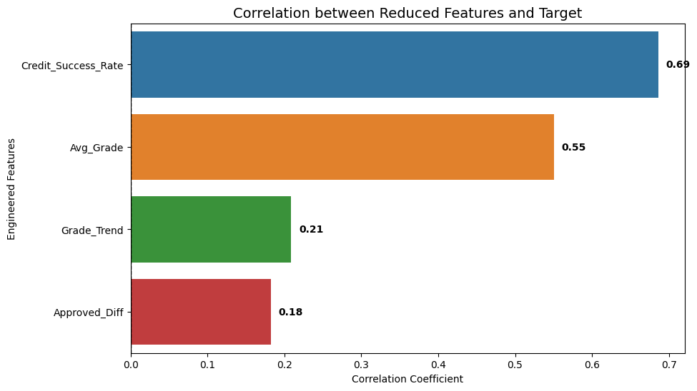
    


## 2. Socio-Economic Features


```python
# 2. Socio-economic Features
socio_cols = [
    'Marital Status', 'Gender', 'Age at enrollment', 'Displaced',
    'Educational special needs', 'Debtor', 'Tuition fees up to date',
    'Scholarship holder', 'International', 'Nationality'
]

plt.figure(figsize=(10, 8))
corr_socio = full_df[socio_cols].corr()
mask = np.triu(np.ones_like(corr_socio, dtype=bool))

sns.heatmap(corr_socio, annot=True, fmt=".2f", cmap='coolwarm', center=0, linewidths=0.5)
plt.title('Feature Correlation: Socio-economic Factors', fontsize=15, pad=20)
plt.show()

# Insight: Often Mother's and Father's qualifications are correlated.
# You might simplify this later to "Highest Parental Education Level".
```


    
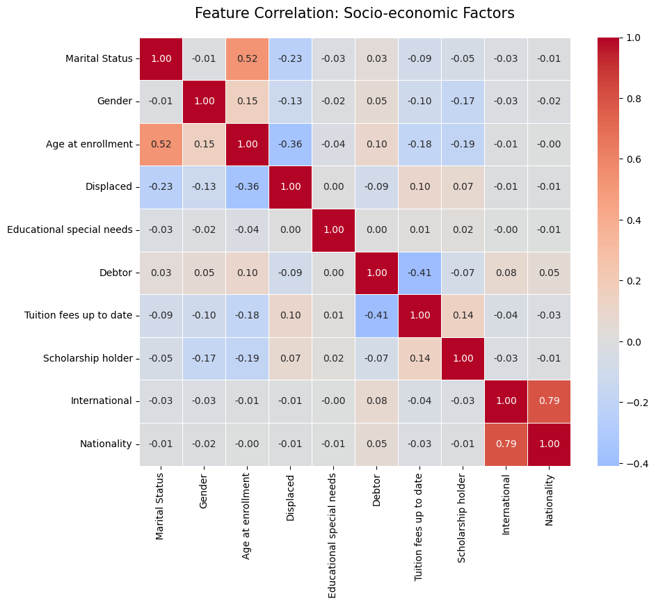
    


We shall remove **Nationality** as it is redundant with "International"


```python
if "Nationality" in reduced_df.columns:
    reduced_df = reduced_df.drop(columns=["Nationality"])


print("Removed Nationality")
print(f"- Number of features remaining: {len(reduced_df.columns)}")
```

    Removed Nationality
    - Number of features remaining: 29


## 3. Enrollment Features


```python
# 3. Enrollment Features List
background_cols = [
    'Application mode', 'Application order', 'Course',
    'Daytime/evening attendance', 'Previous qualification',
    'Previous qualification (grade)', 'Admission grade',
    'Mother\'s qualification', 'Father\'s qualification',
    'Mother\'s occupation', 'Father\'s occupation'
]

plt.figure(figsize=(12, 10))
corr_back = full_df[background_cols].corr()
mask = np.triu(np.ones_like(corr_back, dtype=bool))

sns.heatmap(corr_back, annot=True, fmt=".2f", cmap='BrBG', center=0, linewidths=0.5)
plt.title('Feature Correlation: Enrollment Background', fontsize=15, pad=20)
plt.show()

# Insight: 'Debtor' and 'Tuition fees up to date' usually have a strong negative correlation.
# If a student is a debtor, their fees are likely not up to date.
```


    
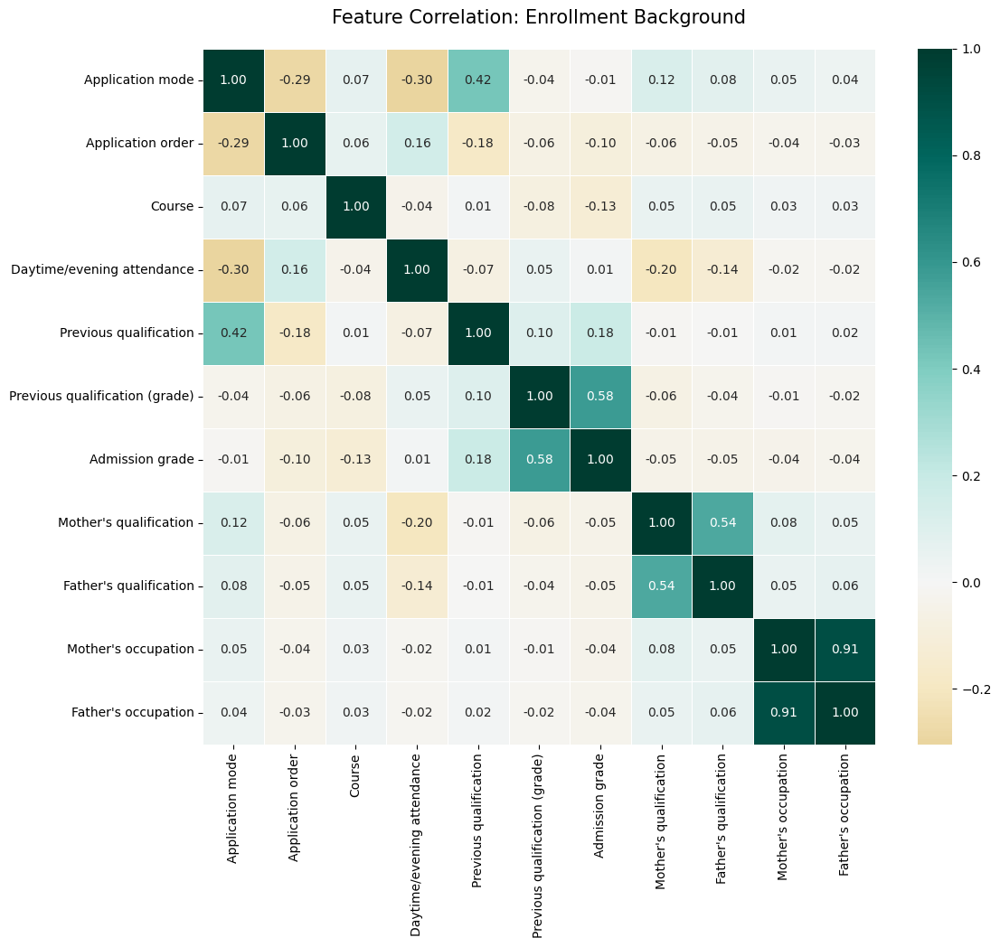
    


We shall remove **Father's occupation** as it indicating extreme redundancy


```python
# 1. The correlation between parental occupation and occupation was high (0.91)
# We removed Father's occupation as they are extreme redundancy
if "Father's occupation" in reduced_df.columns:
    reduced_df = reduced_df.drop(columns=["Father's occupation"])

# 2. We retain them parents' education level (0.54) and academic performance (0.58)
# Because they retain enough unique information
print("- Removed Father's occupation (r=0.91)。")
print(f"- Number of features remaining: {len(reduced_df.columns)}")
```

    - Removed Father's occupation (r=0.91)。
    - Number of features remaining: 28


## 4. Macroeconomic Features


```python
# 4. Macroeconomic Features List
macro_cols = ['Unemployment rate', 'Inflation rate', 'GDP']

plt.figure(figsize=(8, 6))
corr_macro = full_df[macro_cols].corr()
mask = np.triu(np.ones_like(corr_macro, dtype=bool))

sns.heatmap(corr_macro, annot=True, fmt=".2f", cmap='YlGnBu', center=0, linewidths=0.5)
plt.title('Feature Correlation: Macroeconomic Indicators', fontsize=15, pad=20)
plt.show()

# Insight: 'Nacionality' and 'International' will have near-perfect correlation.
# You should definitely drop one of these two to avoid redundancy.
```


    
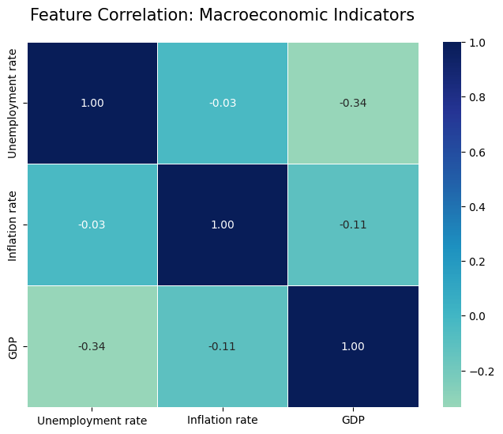
    


### **GDP, Unemployment rate, and Inflation rate**

While they are included in the original UCI dataset to provide "macro-economic context," they are frequently dropped or ignored for four specific reasons:

1. The "Granularity Mismatch"
GDP is a macro-level variable (national level), while dropout is a micro-level event (individual level). The Problem: In this dataset, every student who enrolled in the same year is assigned the exact same GDP and Unemployment value. The Result: The model struggles to learn from this because the feature doesn't vary between the "Success" student and the "Dropout" student who started in the same semester. It lacks "discriminatory power."

2. Lack of Variance
Because the data was collected over a limited number of years, there are only a handful of unique values for GDP in the entire column of thousands of rows.If a feature is almost a constant (or has very few levels), it provides almost zero information to a machine learning model.

3. Indirect vs. Direct Influence (Proxies)
Macro-economic factors like GDP do affect students, but they do so indirectly.Example: A low GDP might lead to a student's father losing his job, which makes the student a "Debtor." The Dataset Logic: Since the dataset already contains direct variables like "Debtor," "Scholarship holder," and "Tuition fees up to date," the "GDP" variable becomes redundant. The direct variables "absorb" the impact of the macro-economic ones.
4. Multicollinearity with other Macro-features
GDP, Unemployment, and Inflation are usually highly correlated with each other (as one goes down, the others move in predictable ways). Including all three can cause mathematical instability in models like Logistic Regression.


```python
# 1. Screening macroeconomic characteristics
macro_cols = ['Tuition fees up to date', 'Unemployment rate', 'Inflation rate', 'GDP', 'Target_num']
macro_corr = full_df[macro_cols].corr()['Target_num'].drop('Target_num')

# 2. Plot
plt.figure(figsize=(8, 5))
sns.barplot(x=macro_corr.values, y=macro_corr.index, palette='magma')
plt.axvline(x=0.1, color='red', linestyle='--', label='Significance Threshold (0.1)')
plt.axvline(x=-0.1, color='red', linestyle='--')
plt.title('Macroeconomic Impact on Target', fontsize=12)
plt.xlabel('Correlation Coefficient')
plt.xlim(-1, 1) # Standardize the range to show its small size
plt.legend()
plt.show()

print("Macroeconomic features show a low correlation with target (Lower than threshold, 0.1)")
```
    
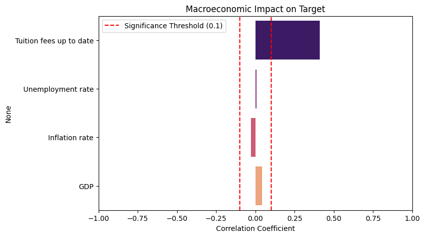
    


    Macroeconomic features show a low correlation with target (Lower than threshold, 0.1)


*   **Tuition fees up to date:** Usually has a high correlation (approx **0.40+**) with success.
* **GDP:** Usually has a very near-zero correlation (approx **0.04**) with success.

**Verdict for your project:**
* If you are using **Linear Models** (Logistic Regression, SVM), you should **drop** GDP/Unemployment/Inflation to keep the model simple.
* If you are using **Tree-based Models** (Random Forest, XGBoost), you can **keep** them; the model will simply ignore them or give them a "Feature Importance" score of nearly zero, so they won't do much harm, but they won't help much either.


```python
# Remove all macroeconomic features
macro_to_drop = ['Unemployment rate', 'Inflation rate', 'GDP']
reduced_df = reduced_df.drop(columns=[col for col in macro_to_drop if col in reduced_df.columns])

print(f"Macroeconomic features (3) are removed. Remaining: {len(reduced_df.columns)}")
```

    Macroeconomic features (3) are removed. Remaining: 25


### **Preparing for modeling - Clean Target**


```python
# 1. Remove the original string from the Target field
if 'Target' in reduced_df.columns:
    reduced_df = reduced_df.drop(columns=['Target'])

# 2. Rename Target_num back to Target
if 'Target_num' in reduced_df.columns:
    reduced_df = reduced_df.rename(columns={'Target_num': 'Target'})

print(f"Final Number of features remaining: {len(reduced_df.columns)}")
print(reduced_df.info())
```

    Final Number of features remaining: 24
    <class 'pandas.core.frame.DataFrame'>
    RangeIndex: 4424 entries, 0 to 4423
    Data columns (total 24 columns):
     #   Column                          Non-Null Count  Dtype  
    ---  ------                          --------------  -----  
     0   Marital Status                  4424 non-null   int64  
     1   Application mode                4424 non-null   int64  
     2   Application order               4424 non-null   int64  
     3   Course                          4424 non-null   int64  
     4   Daytime/evening attendance      4424 non-null   int64  
     5   Previous qualification          4424 non-null   int64  
     6   Previous qualification (grade)  4424 non-null   float64
     7   Mother's qualification          4424 non-null   int64  
     8   Father's qualification          4424 non-null   int64  
     9   Mother's occupation             4424 non-null   int64  
     10  Admission grade                 4424 non-null   float64
     11  Displaced                       4424 non-null   int64  
     12  Educational special needs       4424 non-null   int64  
     13  Debtor                          4424 non-null   int64  
     14  Tuition fees up to date         4424 non-null   int64  
     15  Gender                          4424 non-null   int64  
     16  Scholarship holder              4424 non-null   int64  
     17  Age at enrollment               4424 non-null   int64  
     18  International                   4424 non-null   int64  
     19  Target                          4424 non-null   int64  
     20  Grade_Trend                     4424 non-null   float64
     21  Approved_Diff                   4424 non-null   int64  
     22  Credit_Success_Rate             4424 non-null   float64
     23  Avg_Grade                       4424 non-null   float64
    dtypes: float64(5), int64(19)
    memory usage: 829.6 KB
    None


### **Categorical Encoding: One-Hot Encoding**


```python
# Define the categorical features that require One-Hot Encoding.
categorical_features = [
    'Marital Status', 'Application mode', 'Course',
    'Previous qualification', "Mother's qualification",
    "Father's qualification", "Mother's occupation"
]

# Use get_dummies function in pandas for conversion.
df_final = pd.get_dummies(reduced_df, columns=categorical_features, drop_first=True)

print(f"Dimention after One-Hot Encoding: {df_final.shape}")
```

    Dimention after One-Hot Encoding: (4424, 163)


### **Feature Scaling: Standardization**


```python
from sklearn.preprocessing import StandardScaler

# Exclude the Target field
X = df_final.drop(columns=['Target'])
y = df_final['Target']

scaler = StandardScaler()
X_scaled = scaler.fit_transform(X)

# Switch back to DataFrame for easier observation
X_scaled_df = pd.DataFrame(X_scaled, columns=X.columns)
```

# **Part 4: Choosing a regression model**


**Train-Test Split**
```python
from sklearn.model_selection import train_test_split

# Mapping: 0 for Dropout, 1 for Success (combining Enrolled and Graduate)
y_binary = y.map({0: 0, 1: 1, 2: 1})

X_train, X_test, y_train_binary, y_test_binary = train_test_split(
    X_scaled_df, y_binary, test_size=0.2, random_state=42, stratify=y
)

print(f"Train: {len(X_train)}")
print(f"Test: {len(X_test)}")
```

    Train: 3539
    Test: 885


```python
from sklearn.metrics import classification_report, confusion_matrix, accuracy_score
import seaborn as sns
import matplotlib.pyplot as plt

# Establish an assessment FUNCTION
def evaluate_model(model, X_test, y_test, model_name="Model"):
    y_pred = model.predict(X_test)
    # Define the corresponding name
    target_names = ['Dropout', 'Success']

    print(f"--- {model_name} Evaluation ---")
    print(f"Accuracy: {accuracy_score(y_test, y_pred):.4f}")
    print("\nClassification Report:")
    print(classification_report(y_test, y_pred, target_names=target_names))

    # Plot confusion matrix
    plt.figure(figsize=(8, 6))
    cm = confusion_matrix(y_test, y_pred)

    # Use target_names as axis labels
    sns.heatmap(cm, annot=True, fmt='d', cmap='Blues',
                xticklabels=target_names,
                yticklabels=target_names)

    plt.xlabel('Predicted', fontsize=12)
    plt.ylabel('True', fontsize=12)
    plt.title(f'Confusion Matrix: {model_name}', fontsize=14)
    plt.show()
```

## **Baseline (Logistic Regression)**


```python
from sklearn.linear_model import LogisticRegression
from sklearn.model_selection import train_test_split

# 1. Initialize the model
# Setting max_iter=1000 to ensures that gradient descent converges
# Using 'liblinear' for small-to-medium datasets; 'max_iter' increased for convergence
# Use 'balanced' to let the model assign weights according to the sample proportions
log_model = LogisticRegression(max_iter=1000, random_state=42, class_weight='balanced')

# 2. Training the model
log_model.fit(X_train, y_train_binary)

# 3. Using our evaluation function
evaluate_model(log_model, X_test, y_test_binary, model_name="Logistic Regression")
```

    --- Logistic Regression Evaluation ---
    Accuracy: 0.8452
    
    Classification Report:
                  precision    recall  f1-score   support
    
         Dropout       0.74      0.81      0.77       284
         Success       0.90      0.86      0.88       601
    
        accuracy                           0.85       885
       macro avg       0.82      0.83      0.83       885
    weighted avg       0.85      0.85      0.85       885
    


    
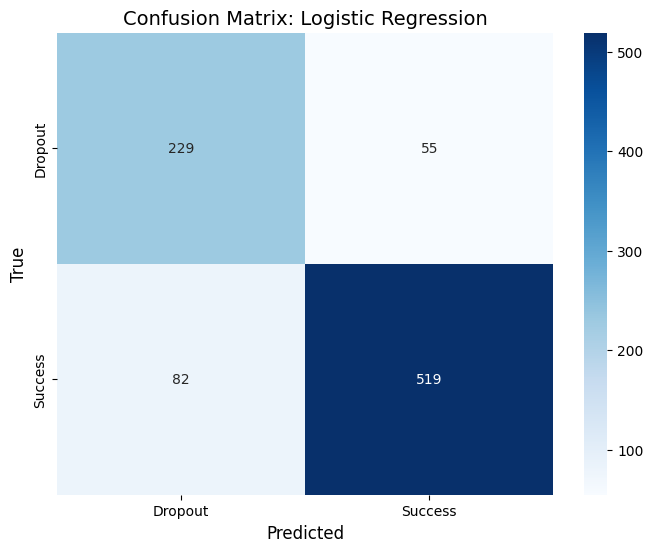
    


```python
# Extract the feature that contributes mostly to the prediction of "Dropout" (category 0).
feature_importance = pd.DataFrame({
    'Feature': X_train.columns,
    'Coefficient': log_model.coef_[0]  # Refer to the Dropout category
})

# 1. Create the corresponding dictionary (based on the official metadata).
mapping_dict = {
    # Core Academic & Financial Features
    'Tuition fees up to date': 'Financial: Tuition Paid up to Date',
    'Debtor': 'Financial: Debt Owed (Debtor)',
    'Scholarship holder': 'Financial: Scholarship Holder',

    # Course / Major Information
    'Course_171': 'Course 171: Animation & Multimedia Design',
    'Course_9853': 'Course 9853: Social Service',
    'Course_9130': 'Course 9130: Equiniculture (Horse Management)',
    'Course_9773': 'Course 9773: Journalism and Communication',
    'Course_9991': 'Course 9991: Management (Evening)',
    'Course_9500': 'Course 9500: Nursing',

    # Demographic & Application Mode
    'Age at enrollment': 'Demographic: Age at Enrollment',
    'Application mode_39': 'Application Mode: Mature Student (Over 23 Entry)',
    'Application mode_53': 'Application Mode: Short Cycle Diploma Holders',
    'Previous qualification_4': 'Prev Qual: High School Incomplete',

    # Maternal Background (Occupation - Crucial for your LogReg results)
    'Mother\'s occupation_9': 'Mother\'s Job: Scientific/Intellectual Profession',
    'Mother\'s occupation_4': 'Mother\'s Job: Administrative Staff',
    'Mother\'s occupation_134': 'Mother\'s Job: Skilled Worker (Industry)',
    'Mother\'s occupation_144': 'Mother\'s Job: Manual Worker (Agriculture/Fishery)',
    'Mother\'s occupation_191': 'Mother\'s Job: Unskilled Worker (Services)',
    'Mother\'s occupation_90': 'Mother\'s Job: Other Unskilled Worker',

    # Parental Education (Qualification)
    'Mother\'s qualification_11': 'Mother\'s Edu: Primary Education (1st Cycle)',
    'Mother\'s qualification_34': 'Mother\'s Edu: Higher Education (Degree)',
    'Father\'s qualification_34': 'Father\'s Edu: Unknown', # Based on common UCI encoding 34 is often Higher Ed or Unknown; please verify with your metadata
}

# 2. Process your characteristic coefficient results
# Assume your feature coefficients are stored in the feature_importance DataFrame.
feature_importance['Factor'] = feature_importance['Feature'].map(mapping_dict).fillna(feature_importance['Feature'])

# 3. Reorder and display
top_10_mapped = feature_importance.sort_values(by='Coefficient', ascending=False).head(10)

print("--- Top 10 Factors Leading to Dropout ---")
print(top_10_mapped[['Factor', 'Coefficient']])
```

    --- Top 10 Factors Leading to Dropout ---
                                                 Factor  Coefficient
    14                              Credit_Success_Rate     1.975923
    7                Financial: Tuition Paid up to Date     0.767217
    158          Mom's Job: Unskilled Worker (Services)     0.610747
    38        Course 171: Animation & Multimedia Design     0.550251
    139   Mom's Job: Scientific/Intellectual Profession     0.398394
    134                 Mom's Job: Administrative Staff     0.316369
    36    Application Mode: Short Cycle Diploma Holders     0.278343
    13                                    Approved_Diff     0.277627
    151  Mom's Job: Manual Worker (Agriculture/Fishery)     0.274619
    148            Mom's Job: Skilled Worker (Industry)     0.263262


## **Random Forest**


```python
from sklearn.ensemble import RandomForestClassifier

# 1. Initialize model
# n_estimators=100 represent established 100 trees
# random_state=42 ensure consistent results each time for easier to write reports
rf_model = RandomForestClassifier(n_estimators=100, class_weight='balanced', max_depth=10, random_state=42)

# 2. Training the model
rf_model.fit(X_train, y_train_binary)

# 3. Using our evaluation function
evaluate_model(rf_model, X_test, y_test_binary, model_name="Random Forest")
```

    --- Random Forest Evaluation ---
    Accuracy: 0.8588
    
    Classification Report:
                  precision    recall  f1-score   support
    
         Dropout       0.76      0.82      0.79       284
         Success       0.91      0.88      0.89       601
    
        accuracy                           0.86       885
       macro avg       0.84      0.85      0.84       885
    weighted avg       0.86      0.86      0.86       885
    


    

    


```python
# Extracted importance of features
rf_importance = pd.DataFrame({
    'Feature': X_train.columns,
    'Importance': rf_model.feature_importances_
})

# Sort out the top 10
top_10_rf = rf_importance.sort_values(by='Importance', ascending=False).head(10)

# Adding mapping description for easier reading
top_10_rf['Factor'] = top_10_rf['Feature'].map(mapping_dict).fillna(top_10_rf['Feature'])

print("--- Random Forest Top 10 Feature Importance ---")
print(top_10_rf[['Factor', 'Importance']])
```

    --- Random Forest Top 10 Feature Importance ---
                                    Factor  Importance
    14                 Credit_Success_Rate    0.326042
    15                           Avg_Grade    0.185061
    7   Financial: Tuition Paid up to Date    0.072186
    12                         Grade_Trend    0.052337
    10      Demographic: Age at Enrollment    0.044631
    6        Financial: Debt Owed (Debtor)    0.025143
    13                       Approved_Diff    0.024789
    9        Financial: Scholarship Holder    0.024504
    3                      Admission grade    0.023468
    2       Previous qualification (grade)    0.021039


**For Random Forest, the top 3 are our engineered features!!!**

# **Part 5: Live Demo Predictor**


```python
def live_predictor_hku_style():
    print("--- 🎓 Student Success Prediction (HKU Edition) ---")
    print("Please enter the academic details (GPA 4.3 Scale):")

    try:
        # 1. Inputs using local campus standards
        total_courses = float(input("How many courses did you take this year? (e.g., 10): "))
        passed_courses = float(input("How many courses did you pass? (e.g., 8): "))

        gpa_sem1 = float(input("GPA in Semester 1 (0 - 4.3): "))
        gpa_sem2 = float(input("GPA in Semester 2 (0 - 4.3): "))

        age = float(input("Age at enrollment (e.g., 18): "))
        tuition_val = float(input("Tuition fees settled? (1: Yes, 0: No): "))

        # 2. Conversion Logic to match original dataset (0-20 scale)
        # Mapping GPA 4.3 to 20 scale
        score_sem1 = (gpa_sem1 / 4.3) * 20
        score_sem2 = (gpa_sem2 / 4.3) * 20

        # Mapping Credits (6 units per course)
        # Note: Success Rate remains the same regardless of multiplier
        success_rate = passed_courses / total_courses if total_courses > 0 else 0
        avg_grade = (score_sem1 + score_sem2) / 2
        grade_trend = score_sem2 - score_sem1

        # 3. Prepare Feature Vector
        sample_data = X_train.mean().to_frame().T

        # 4. Fill with converted values
        sample_data['Credit_Success_Rate'] = success_rate
        sample_data['Avg_Grade'] = avg_grade
        sample_data['Grade_Trend'] = grade_trend
        sample_data['Age at enrollment'] = age
        sample_data['Tuition fees up to date'] = tuition_val

        # 5. Scaling and Prediction
        sample_scaled_array = scaler.transform(sample_data)
        sample_scaled_df = pd.DataFrame(sample_scaled_array, columns=X_train.columns)

        prediction = rf_model.predict(sample_scaled_df)[0]
        probability = rf_model.predict_proba(sample_scaled_df)[0]

        # 6. Output mapping
        target_map = {0: "DROPOUT (High Risk)",
                      1: "SUCCESS (Stay / Graduate)"}

        print("-"*50)
        print(f"Calculated to fit European model:")
        print(f"Average Grade (20 Credit System): {avg_grade:.2f}/20")
        print(f"Course Pass Rate: {success_rate*100:.1f}% ({int(passed_courses)}/{int(total_courses)})")
        print("\n" + "*" * 50)
        print("               ASSESSMENT RESULT")
        print("*" * 50)
        print(f"Final Prediction: {target_map[prediction]}")
        print(f"Model Confidence: {probability[prediction]*100:.2f}%")
        print("*"*50)

    except ValueError:
        print("Error: Please check your input format.")

# Run the localized predictor
live_predictor_hku_style()
```

    --- 🎓 Student Success Prediction (HKU Edition) ---
    Please enter the academic details (GPA 4.3 Scale):
    How many courses did you take this year? (e.g., 10): 10
    How many courses did you pass? (e.g., 8): 10
    GPA in Semester 1 (0 - 4.3): 2.0
    GPA in Semester 2 (0 - 4.3): 2.2
    Age at enrollment (e.g., 18): 19
    Tuition fees settled? (1: Yes, 0: No): 1
    --------------------------------------------------
    Calculated to fit European model:
    Average Grade (20 Credit System): 9.77/20
    Course Pass Rate: 100.0% (10/10)
    
    **************************************************
                   ASSESSMENT RESULT
    **************************************************
    Final Prediction: SUCCESS (Stay / Graduate)
    Model Confidence: 61.40%
    **************************************************


**Extra: XGBoost for binary classification**<br>
Target Class Consolidation: Dropout (0) and Success (1)


```python
from xgboost import XGBClassifier
from sklearn.utils.class_weight import compute_sample_weight
from sklearn.metrics import classification_report, confusion_matrix, accuracy_score
import seaborn as sns
import matplotlib.pyplot as plt

# 2. Initialize and train the binary model
weights = compute_sample_weight(class_weight='balanced', y=y_train_binary)
xgb_binary = XGBClassifier(
    n_estimators=100,
    learning_rate=0.1,
    max_depth=5,
    objective='binary:logistic', # Changed to binary
    random_state=42,
    eval_metric='logloss'
)

xgb_binary.fit(X_train, y_train_binary)

# 3. Evaluation for Binary Classification
y_pred_binary = xgb_binary.predict(X_test)
target_names_binary = ['Dropout', 'Success']

print(f"--- Binary XGBoost Evaluation ---")
print(f"Accuracy: {accuracy_score(y_test_binary, y_pred_binary):.4f}")
print("\nClassification Report:")
print(classification_report(y_test_binary, y_pred_binary, target_names=target_names_binary))

# 4. Confusion Matrix Plot
plt.figure(figsize=(7, 5))
cm_binary = confusion_matrix(y_test_binary, y_pred_binary)
sns.heatmap(cm_binary, annot=True, fmt='d', cmap='Greens',
            xticklabels=target_names_binary,
            yticklabels=target_names_binary)
plt.xlabel('Predicted')
plt.ylabel('True')
plt.title('Confusion Matrix: XGBoost')
plt.show()
```

    --- Binary XGBoost Evaluation ---
    Accuracy: 0.8678
    
    Classification Report:
                  precision    recall  f1-score   support
    
         Dropout       0.83      0.74      0.78       284
         Success       0.88      0.93      0.91       601
    
        accuracy                           0.87       885
       macro avg       0.86      0.83      0.84       885
    weighted avg       0.87      0.87      0.87       885
    


    
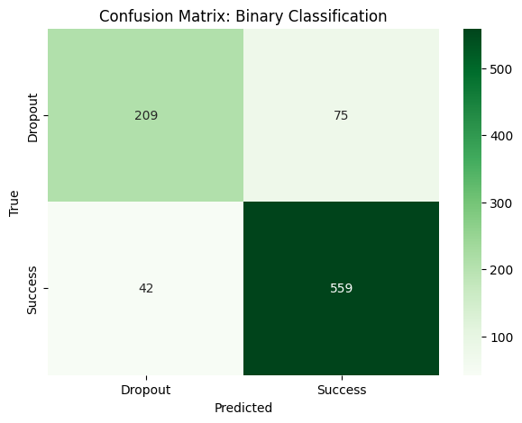
    


```python
# Extracting importance for the binary model
xgb_bin_importance = pd.DataFrame({
    'Feature': X_train.columns,
    'Importance': xgb_binary.feature_importances_
})

# Mapping descriptions
xgb_bin_importance['Description'] = xgb_bin_importance['Feature'].map(mapping_dict).fillna(xgb_bin_importance['Feature'])

# Sort and display Top 10
top_10_binary = xgb_bin_importance.sort_values(by='Importance', ascending=False).head(10)

print("=== Top 10 Features: Binary Classification ===")
print(top_10_binary[['Description', 'Importance']])
```

    === Top 10 Features: Binary Classification ===
                                           Description  Importance
    14                             Credit_Success_Rate    0.186880
    38       Course 171: Animation & Multimedia Design    0.079622
    7               Financial: Tuition Paid up to Date    0.074054
    120           Dad's Edu: Higher Education (Degree)    0.021970
    13                                   Approved_Diff    0.020101
    52                     Course 9853: Social Service    0.019565
    10                  Demographic: Age at Enrollment    0.017365
    6                    Financial: Debt Owed (Debtor)    0.016067
    87            Mom's Edu: Higher Education (Degree)    0.015567
    44   Course 9130: Equiniculture (Horse Management)    0.015066


```python
import pandas as pd
import numpy as np

def run_academic_risk_demo(model, feature_names, X_train):
    print("-" * 60)
    print("      GRADUATE VS. DROPOUT RISK ASSESSMENT")
    print("-" * 60)

    # Start with a baseline (median student)
    user_data = X_train.median().to_dict()

    print("Please provide student details:")

    # 1. Automatic Credit Rate Calculation
    try:
        taken = float(input("Number of courses enrolled last term (e.g., 5): ") or 5)
        passed = float(input("Number of courses passed last term (e.g., 4): ") or 4)
        user_data['Credit_Success_Rate'] = passed / taken if taken > 0 else 0
    except ValueError:
        user_data['Credit_Success_Rate'] = 0.8 # Fallback

    # 2. Automatic Mature Student Logic
    try:
        age = float(input("Student's age at enrollment (e.g., 18): ") or 18)
        user_data['Age at enrollment'] = age
        # Automatically determine "Mature Student" status
        user_data['Application mode_39'] = 1 if age > 23 else 0
    except ValueError:
        user_data['Age at enrollment'] = 18
        user_data['Application mode_39'] = 0

    # 3. Direct Binary Questions (Simple Yes/No)
    questions = [
        ('Tuition fees up to date', 'Are tuition fees fully paid? (1: Yes, 0: No): '),
        ('Scholarship holder', 'Is the student a scholarship holder? (1: Yes, 0: No): '),
        ('Debtor', 'Does the student have any outstanding debt? (1: Yes, 0: No): ')
    ]

    for feat, q in questions:
        val = input(q)
        user_data[feat] = float(val) if val.strip() != "" else user_data[feat]

    # 4. Major Selection
    print("\nSelect Major: [0] General [1] Animation [2] Social Service [3] Nursing")
    m_choice = input("Choice: ")
    for m in ['Course_171', 'Course_9853', 'Course_9500']: user_data[m] = 0
    if m_choice == '1': user_data['Course_171'] = 1
    elif m_choice == '2': user_data['Course_9853'] = 1
    elif m_choice == '3': user_data['Course_9500'] = 1

    # Final Prediction
    input_df = pd.DataFrame([user_data])[feature_names]
    prob = model.predict_proba(input_df)[0]
    pred = model.predict(input_df)[0]

    print("\n" + "="*40)
    status = "Success (Stay)" if pred == 1 else "Dropout (High Risk)"
    confidence = prob[1] if pred == 1 else prob[0]
    print(f"Prediction: {status}")
    print(f"Confidence: {confidence*100:.2f}%")
    print("="*40)

# run_academic_risk_demo(xgb_binary, X_train.columns, X_train)
```

# **ROC**


```python
from sklearn.metrics import precision_recall_curve, average_precision_score
import matplotlib.pyplot as plt

def plot_pr_curve(models, X_test, y_test):
    plt.figure(figsize=(10, 7))

    for name, model in models.items():
        # Get the prediction probabilities for Dropout (Class 0)
        # Note: If 0 is Dropout in your y_test, the probabilities are usually probs[:, 0]
        # However, some Scikit-learn functions default to Class 1; you need to confirm your codes.
        probs = model.predict_proba(X_test)[:, 0]

        # Calculate PR data (Here we assume we are interested in Class 0: Dropout)
        # To calculate Dropout Recall, y_true needs to be converted to: Dropout=1, Success=0
        y_true_dropout = (y_test == 0).astype(int)

        precision, recall, _ = precision_recall_curve(y_true_dropout, probs)
        ap_score = average_precision_score(y_true_dropout, probs)

        plt.plot(recall, precision, label=f'{name} (AP = {ap_score:.2f})')

    plt.xlabel('Recall (Catching Dropouts)')
    plt.ylabel('Precision (Accuracy of Dropout Flags)')
    plt.title('Precision-Recall Curve for Dropout Prediction')
    plt.legend(loc='best')
    plt.show()

models_dict = {
    "Logistic Regression": log_model,
    "Random Forest": rf_model,
    "XGBoost": xgb_binary
}
plot_pr_curve(models_dict, X_test, y_test_binary)
```


    
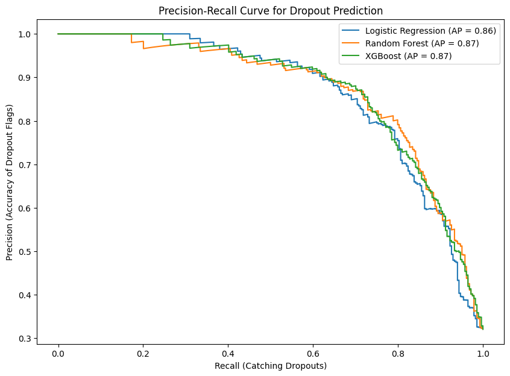
